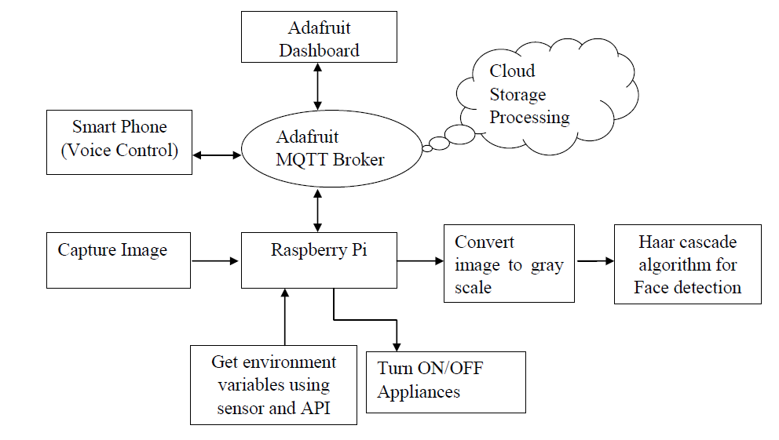
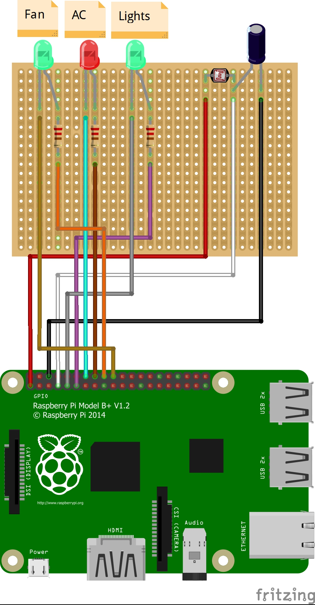

# Building Automation

Building automation can be done using the IOT device - **Raspberry Pi**. Install OpenCV python in your pi before beginning the project. This project allows you to control the appliances like AC,lights automatically using the Haar Cascade Algorithm based on human face detection and manually through Google assistance or Adafruit Dashboard.

## Architecture Diagram

- The MQTT broker is at the heart of any publish/subscribe protocol. Here, the MQTT clients include the **Adafruit dashboard, Google Assistant and Raspberry Pi**.   
- **Auto control** is chosen by the user, and then the automation is activated. The human face can be detected using the **Haar Cascade algorithm**. 
- If the object is a human face, the sensor(LDR) and temperature API detect the environment variables which include luminance, temperature and analyze them. 
- **Light Dependent Resistor** is used to analyze the ambient light. Different lighting has different luminance value. If the lighting is not adequate, then the required lights may be turned on.
- **OpenWeatherMap API** is used to get the current temperature.A temperature greater than 25 C turns on the required HVAC system. On analyzing the variables, the necessary appliances may be turned on or off. 
- If there is no human object or the last person present in the room leaves, all the necessary appliances may be turned off.
- **Raspberry Pi** is connected to the cloud storage for processing.  The changes in the environment variables are updates in the Adafruit cloud.
- MQTT broker continuously monitors the clients. If **voice control** is given through Google Assistant, the lighting and HVAC system can be controlled manually. If voice control has been activated, automation must be deactivated. Appliances can be manually controlled through the Adafruit Dashboard as well. Any changes must be continuously updated in the Adafruit dashboard.

## Circuit Diagram

The diagram shows the connections that must be done with the Raspberry Pi.
